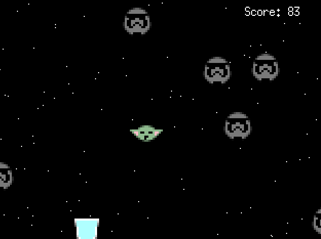

# Avoid

## 概要

"Avoid!"はシンプルな回避ゲームです。

プレイヤーはキャラクターを操作して障害物を避け、アイテムを集めながらスコアを競います。

## ゲームの特徴

- 複数の障害物とアイテムが登場し、状況が刻々と変化します。

- ゲームオーバーになるまでの生存時間とアイテムの回収数によってスコアが決まります。

## プレイ画面



## 開始方法

プログラムを実行するには、以下のコマンドを使用します。

```
go run main.go
```

## 操作方法

- WASDキーでキャラクターを上下左右に移動させます。

- ゲーム開始は`Enter`キー、ゲームオーバー後の再開は`R`キーです。

## 開発環境

- 言語: Go 1.21.5

- ゲームエンジン: [Ebitengine](https://ebitengine.org/ja/)

## ライセンス

"Avoid!"は[Apache License 2.0](https://github.com/hajimehoshi/ebiten/blob/main/LICENSE)で公開されています。

## 謝辞

このゲームは[Ebitengine](https://ebitengine.org/ja/)を使用しています。[Ebitengine](https://ebitengine.org/ja/)の開発者に感謝いたします。